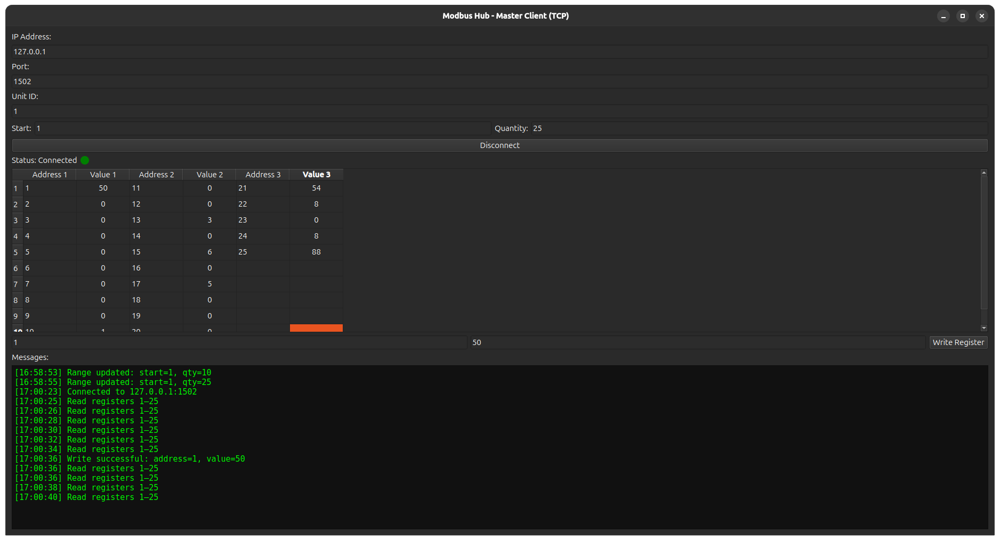
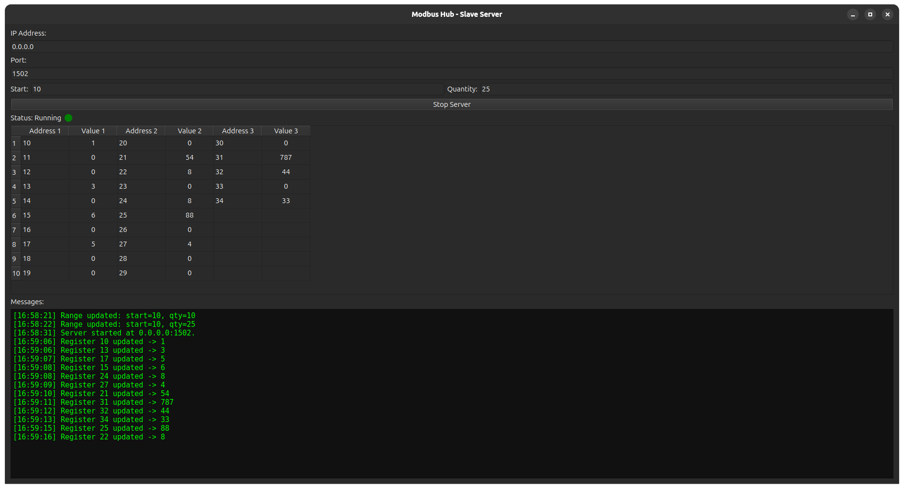

# ⚙️ Modbus Hub

  
  

<h3 align="center">
  
</h3>

---

  
  
  

---

## 🧠 Overview

**Modbus Hub** is a professional and educational **Modbus TCP simulator**,  
featuring two standalone GUI applications built with **PySide6 (Qt for Python)** and **pymodbusTCP**.

- 🟦 **MasterApp (Client)** – connects to a Modbus TCP server, reads/writes registers in real time.
- 🟩 **SlaveApp (Server)** – simulates a Modbus TCP device with editable holding registers.

---

## 🧩 Key Features

| Component                  | Features                                                                                                            |
|----------------------------|---------------------------------------------------------------------------------------------------------------------|
| 🟦 **MasterApp**           | Connect to Modbus TCP servers, read/write holding registers, define ranges, live refresh, connection LED, log panel |
| 🟩 **SlaveApp**            | Simulated Modbus TCP server, editable registers, IP/Port configuration, live sync, server status LED, message log   |
| 🧱 **Shared Architecture** | Modular structure, full input validation, friendly GUI built with PySide6                                           |
| 🧮 **Protocol Compliance** | Supports 65,536 registers, 125 registers per Modbus frame (standard limit)                                          |

---

## ▶️ Usage

The project includes two standalone applications ready to run:

- **Modbus Hub – Master** (Client)
- **Modbus Hub – Slave** (Server)

Simply execute the provided file for your platform.  
No installation or dependency setup is required.

---

## 💾 Executables

The binaries are distributed in compressed packages by platform:

| Platform       | Package Name                            | Description                                |
|----------------|-----------------------------------------|--------------------------------------------|
| 🪟 **Windows** | `ModbusHub_Windows_Binaries_v0.1.0.zip` | Contains both Master and Slave executables |
| 🐧 **Linux**   | `ModbusHub_Linux_Binaries_v0.1.0.zip`   | Contains both Master and Slave executables |

Each package includes:

- `MasterApp` and `SlaveApp` executables.
- Configuration files and internal resources.
- Ready-to-run structure — no additional setup required.

---

## 📸 Screenshots

| Application               | Preview                                                                  |
|---------------------------|--------------------------------------------------------------------------|
| 🟦 **MasterApp (Client)** |  |
| 🟩 **SlaveApp (Server)**  |    |

*(Screenshots are for demonstration; actual UI may vary slightly depending on platform.)*

---

## 📊 Register Model

| Parameter             | Range / Limit                        |
|-----------------------|--------------------------------------|
| Address Space         | 0 – 65535                            |
| Registers per request | ≤ 125                                |
| Function Codes        | 03 (Read Holding), 06 (Write Single) |
| Data Type             | Unsigned 16-bit integer              |

---

## 🧠 Developer Notes

- Modular, documented, and educational design.
- GUI is non-blocking — uses `QTimer`.
- Master and Slave can run on same or separate machines.
- Ideal for **testing and integration development**.

---

## 📈 Roadmap

- [ ] Register type selector
- [ ] Data persistence
- [ ] Export logs to `.txt`
- [ ] Activity LED (blinking)
- [ ] Auto-detect local IP
- [ ] Dark/Light theme toggle

---

## 📜 License

MIT License — free for educational and commercial use with attribution.

---

## 📬 Contact

👨‍💻 **Author:** Camilo Espitia  
🌐 [GitHub](https://github.com/jcespitia)

---

<pre><code>
[ OK ] Documentation loaded successfully – Modbus Hub v1.0.0
</code></pre>

---

<!-- 🧠 Hacker Theme Custom CSS -->

