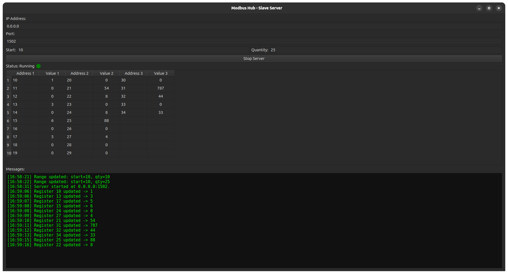
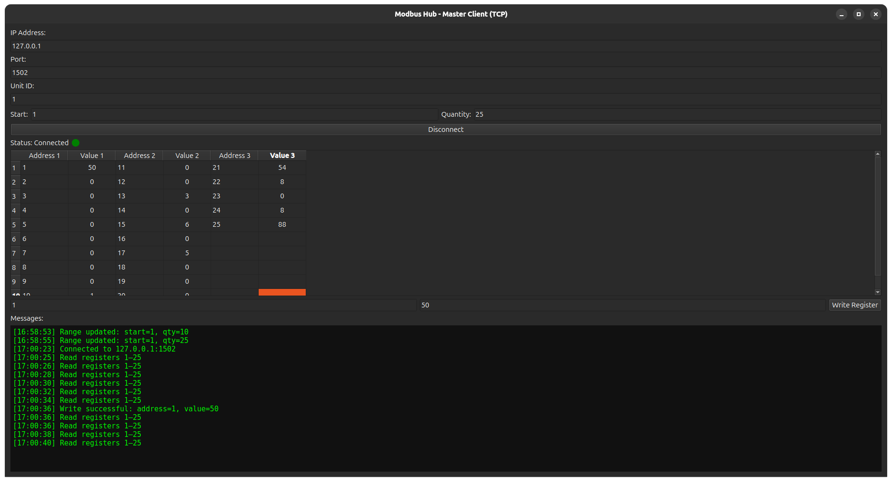

# ⚙️ Modbus Hub  
### Complete Modbus TCP Simulator with GUI (Master & Slave)

> **Version:** 1.0.0  
> **Author:** [Camilo Espitia](https://github.com/jcespitia)  
> **License:** MIT  
> **Technologies:** Python 3.10+, PySide6, pymodbusTCP  

---

## 🧠 Overview

**Modbus Hub** is a professional and educational **Modbus TCP simulator**,  
featuring two standalone GUI applications built with **PySide6 (Qt for Python)** and **pymodbusTCP**.

- 🟦 **MasterApp (Client)** – connects to a Modbus TCP server, reads/writes registers in real time.  
- 🟩 **SlaveApp (Server)** – simulates a Modbus TCP device with editable holding registers.

---

## 🧩 Key Features

| Component | Features |
|------------|-----------|
| 🟦 **MasterApp** | Connect to Modbus TCP servers, read/write holding registers, define ranges, live refresh, connection LED, log panel |
| 🟩 **SlaveApp** | Simulated Modbus TCP server, editable registers, IP/Port configuration, live sync, server status LED, message log |
| 🧱 **Shared Architecture** | Modular structure, full input validation, friendly GUI built with PySide6 |
| 🧮 **Protocol Compliance** | Supports 65,536 registers, 125 registers per Modbus frame (standard limit) |

---

## 🖥️ Screenshots

### 🟩 SlaveApp – Server GUI


### 🟦 MasterApp – Client GUI


> 💡 *Each app can run independently, allowing local or network-based Modbus testing.*

---

## ⚙️ Installation

### 1️⃣ Requirements
- Python 3.10+
- Works on Windows, Linux, or macOS
- Required packages:
  ```bash
  pip install pyside6 pymodbusTCP
  ```

### 2️⃣ Clone the repository
```bash
git clone https://github.com/jcespitia/modbus-hub.git
cd modbus-hub
```

---

## ▶️ Usage

### Start the Slave (Server)
```bash
python slave/slave_app.py
```
- Choose the IP (e.g., `0.0.0.0`) and Port (default `502` or `1502` without admin privileges)
- Click **Start Server**
- The LED turns 🟢 Green

### Start the Master (Client)
```bash
python master/master_app.py
```
- Enter the Slave’s IP and Port, click **Connect**
- The LED turns 🟢 Green and registers update every 2 seconds

---

## 📊 Register Model

| Parameter | Range / Limit |
|------------|----------------|
| Address Space | `0 – 65535` |
| Registers per request | ≤ `125` |
| Function Codes | 03 (Read Holding Registers), 06 (Write Single Register) |
| Data Type | Unsigned 16-bit integer |

---

## 💾 Downloads

| Platform | File | Description |
|-----------|------|-------------|
| 🪟 Windows | [modbus-hub-win64.exe](https://github.com/jcespitia/modbus-hub/releases) | Standalone executable |
| 🐧 Linux | [modbus-hub-linux.tar.gz](https://github.com/jcespitia/modbus-hub/releases) | Binary build |
| 💻 Source | [GitHub Repository](https://github.com/jcespitia/modbus-hub) | Full source code |

> Visit the [**Releases**](https://github.com/jcespitia/modbus-hub/releases/latest) page to get the latest version.

---

## 🧰 Project Structure

```
modbus-hub/
│
├── master/
│   ├── master_app.py        # Master GUI and logic
│   └── modbus_master.py     # TCP client class
│
├── slave/
│   ├── slave_app.py         # Slave GUI and logic
│   └── modbus_slave.py      # TCP server class
│
├── shared/
│   └── utils.py             # Common utilities
│
└── docs/
    ├── index.md
    ├── _config.yml
    └── images/
```

---

## 🌈 User Interface Design

- Dynamic tables with **10-row blocks per column**
- **LED indicators** for connection/server state
- **Log panel** with timestamps (auto-scroll)
- Input validations for all parameters
- Modern flat layout via PySide6 widgets

---

## 🧱 Validation Rules

| Field | Valid Range / Rule |
|--------|--------------------|
| IP Address | Valid IPv4 format (e.g., `192.168.1.10`) |
| Port | 1 – 65535 |
| Unit ID | 1 – 247 |
| Start Address | 0 – 65535 |
| Quantity | 1 – 125 |
| Register Value | 0 – 65535 |

---

## 🧠 Developer Notes

- Code is fully modular and documented (comments in **Spanish**, UI in **English**).
- GUI is non-blocking — uses `QTimer` for periodic updates.
- Master and Slave can run on the same machine or across a network.
- Built for **education, testing, and integration development**.

---

## 📈 Roadmap

- [ ] Add register type selector (Holding / Input / Coils / Discrete Inputs)
- [ ] Data persistence (save/load registers)
- [ ] Export logs to `.txt`
- [ ] Activity LED (blinking)
- [ ] Auto-detect local IP
- [ ] Add dark/light UI theme

---

## 📜 License

This project is licensed under the **MIT License**.  
Free to use for educational, commercial, and testing purposes with attribution.

---

## 📬 Contact

👨‍💻 **Author:** Camilo Espitia  
🌐 **GitHub:** [github.com/jcespitia](https://github.com/jcespitia)

---

> *Modbus Hub — a modern, visual and practical simulator for Modbus TCP communication testing.*
